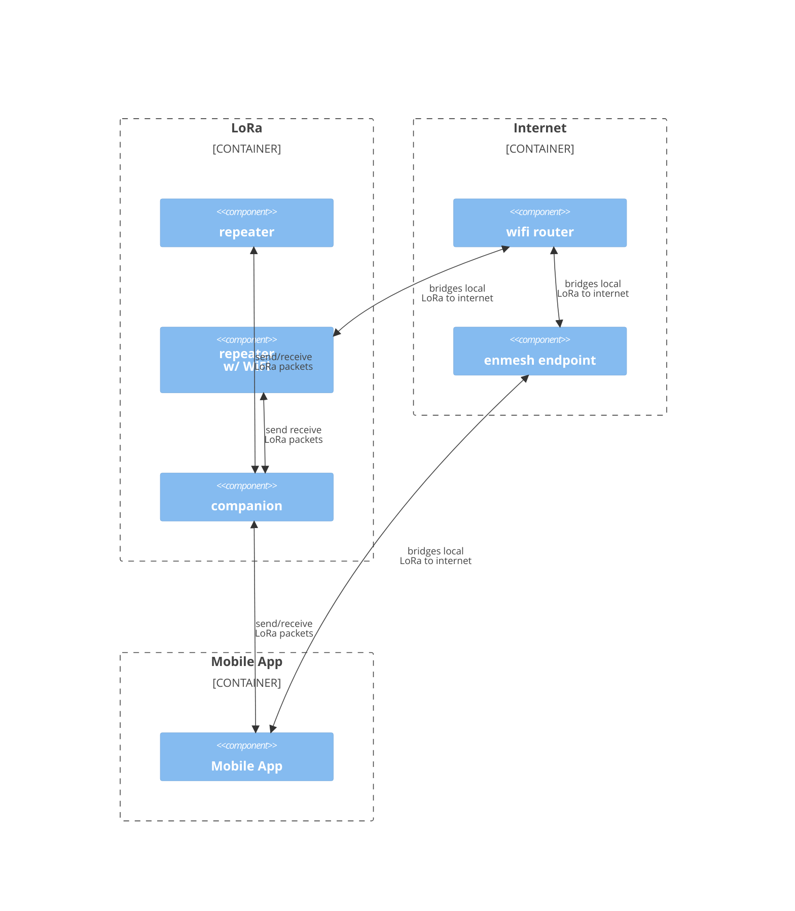

Secure distributed communications enhanced by anonymity of LoRa
================================================================================

* Secured by encryption
  * MeshCore
    * public channels (#<channel>) use a known private key
      * as the private key is known, anyone can create a message
    * user-to-user channels are more secure as only the public keys are necessary
      * sharing public keys
        * advert - publish your public key to the mesh
        * socially - provide your public key to the other user
  * Meshtastic
    * each channel uses an AES256-CTR key
      * there is one common channel with a known key
    * users must have the channel key to transmit/receive messages 
      * sharing channel keys
        * socially - provide the channel key to the other user

Background
--------------------------------------------------------------------------------
[LoRa](https://en.wikipedia.org/wiki/LoRa) use has proliferated under
[Meshtastic](https://meshtastic.org/) and [MeshCore](https://meshcore.co.uk/)
creating LoRa hardware that is readily purchasable by users.

[Reticulum](https://reticulum.network/) proposes that the privacy/anonymity of
LoRa can be extended beyond the local LoRa mesh over the internet.

Connecting LoRa to everything
--------------------------------------------------------------------------------
As Reticulum is no longer active, this is a successor - implemented in Rust to
support both firmware and PC applications.

Connecting a LoRa node to a local WiFi router, extends the reach of a LoRa node
to the world. ESP32 based devices (HelTec) already provide WiFi hardware.

Only a few local LoRa nodes need to support an internet bridge to support
universal messaging via LoRa.

#### Yet Another LoRa Protocol?
Rather than attempt to replace Meshtastic and MeshCore, enmesh will support
both.

#### How?
The [enmesh design](docs/design.md) describes how enmesh nodes connect local
LoRa traffic (Meshtastic/MeshCore) to the world.

Repository Overview
================================================================================
* [Enmesh Endpoint Implementation](endpoint) - internet service to bridge LoRa traffic
* [LoRa Node Implementation(s)](firmware) - supports local LoRa traffic
    * LoRa Meshes
        * [Meshtastic](https://meshtastic.org/)
        * [MeshCore](https://meshcore.co.uk/)
        * enmesh - additional protocols as need arises
    * enmesh WiFi bridge (per hardware support)
* [Mobile Application](mobile_app) - provides enhanced support beyond Meshtastic/MeshCore

* [MeshCore Library](MeshCore) - Rust implemenation of MeshCore protocols
  * TODO: as MeshCore rapidly evolves, this shold become a separate repo

