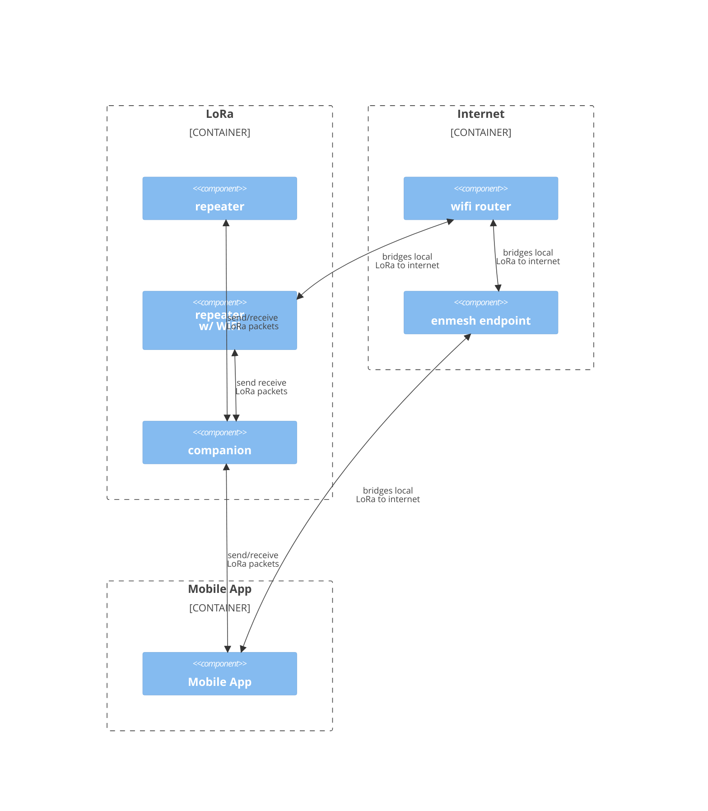

Secure distributed communications enhanced by anonymity of LoRa
================================================================================

Background
--------------------------------------------------------------------------------
[LoRa](https://en.wikipedia.org/wiki/LoRa) use has proliferated under
[Meshtastic](https://meshtastic.org/) and [MeshCore](https://meshcore.co.uk/)
creating LoRa hardware that is readily purchasable by users.

[Reticulum](https://reticulum.network/) proposes that the privacy/anonymity of
LoRa can be extended beyond the local LoRa mesh over the internet.

Connecting LoRa to everything
--------------------------------------------------------------------------------
As Reticulum is no longer active, this is a successor - implemented in Rust to
support both firmware and PC applications.

Connecting LoRa node a WiFi router, extends the reach of a LoRa node to the
world. ESP32 based devices (HelTec) already provide WiFi hardware.

Only a few local LoRa nodes need to support an internet bridge for this to work.

#### Yet Another Protocol?
Rather than attempt to replace Meshtastic and MeshCore, enmesh will support
both.

Where concerns arise, I will reach out to the Meshstastic and MeshCore
developers - only implementing additional novel protocols should the
upstream not be interested.

Repository Overview
================================================================================
* [Enmesh Endpoint Implementation](endpoint) - internet service to bridge LoRa traffic
* [LoRa Node Implementation(s)](firmware) - supports local LoRa traffic
    * LoRa Meshes
        * [Meshtastic](https://meshtastic.org/)
        * [MeshCore](https://meshcore.co.uk/)
        * enmesh - additional protocols as need arises
    * enmesh WiFi bridge (per hardware support)
* [Mobile Application](mobile_app) - provides enhanced support beyond Meshtastic/MeshCore

* [MeshCore Library](MeshCore) - Rust implemenation of MeshCore protocols
  * TODO: as MeshCore rapidly evolves, this shold become a separate repo

