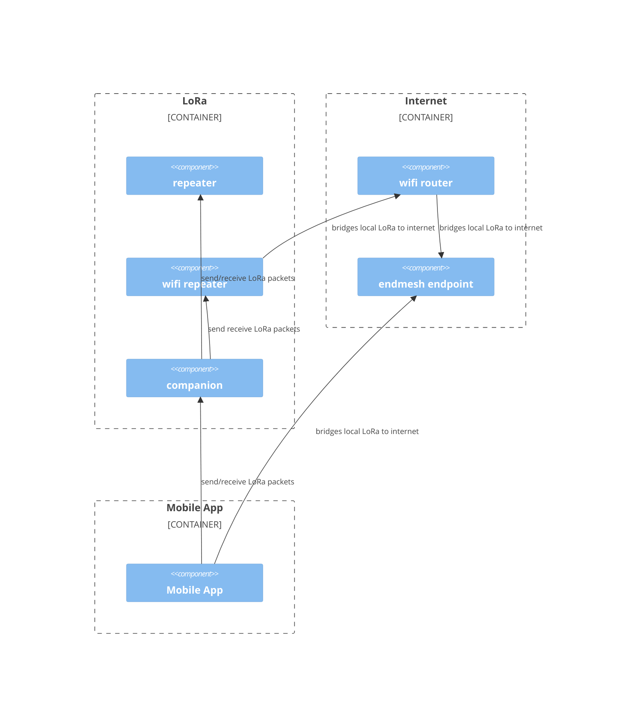

Secure distributed communications enhanced by anonymity of LoRa
================================================================================

Background
--------------------------------------------------------------------------------
[LoRa](https://en.wikipedia.org/wiki/LoRa) use has proliferated under
[Meshtastic](https://meshtastic.org/) and [MeshCore](https://meshcore.co.uk/)
creating LoRa hardware that is readily purchasable by users.

[Reticulum](https://reticulum.network/) proposes that the privacy/anonymity of
LoRa can be extended beyond the reach of LoRa.

Connecting LoRa to everything
--------------------------------------------------------------------------------
Connecting LoRa node a WiFi router, extends the reach of a LoRa node to the
world. Some readily purchasable mesh hardware supports WiFi.

Only a few LoRa nodes need to support an IP bridge for this to work.

The LoRa traffic will be encapsulated in an IP packet (and vice-versa).

<!-- The IP endpoint(s) are determined by a query for enmesh bridge nodes. -->

What you'll find here
================================================================================
* Bridge Node Implementation - internet service to bridge LoRa traffic
* LoRa Node Implementation - supports local LoRa traffic
    * Meshes
        * Meshtastic
        * MeshCore
        * enmesh
    * WiFi bridge (per hardware support)
* Mobile Application - provides enhanced support beyond Meshtastic/MeshCore

