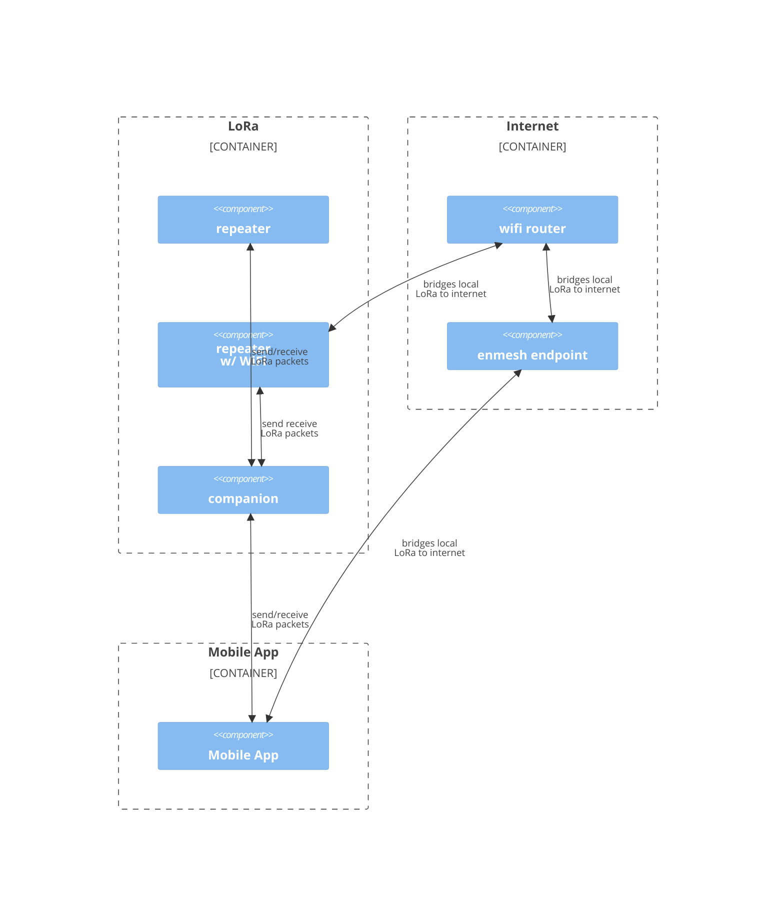

Secure distributed communications enhanced by anonymity of LoRa
================================================================================
Objectives
--------------------------------------------------------------------------------
* Anonymous Communication
  - sender's location is obfuscated by the mesh network
* Minimize contention for LoRa air time

Background
--------------------------------------------------------------------------------
[LoRa](https://en.wikipedia.org/wiki/LoRa) use has proliferated under
[Meshtastic](https://meshtastic.org/) and [MeshCore](https://meshcore.co.uk/)
creating LoRa hardware that is readily purchasable by users.

[Reticulum](https://reticulum.network/) is a proposed design for creating
"sovereign" communication networks that bridge LoRa traffic over additional
channels (e.g. internet).

### LoRa Evolution
While novel protocols have increased the usage of LoRa, LoRa needs to evolve
via consensus make efficient use of the bandwidth.
The [IETF](https://www.ietf.org/) has managed the evolution of the internet
and should be used to evolve LoRa.
[see RFCs](https://github.com/redengin/enmesh/wiki/RFC)

<!--
### Societal Evolution
The primary human right is the ability to communicate. Societies that restrict
communication impede the evolution of the society, making them susceptible to
being overcome by larger societies.

Censoring communication is used by people that wish to control societal
evolution. Currently, most people won't talk to another person directly -
but would rather use a social platform to provide some level of anonymity.

**For societal evolution to be possible, people need to be able to communicate
anonymously.**

There will be communications that you find abhorent and you should use
your ability to communicate to stop the perpetrators.
-->

Enmesh Physical Archicture
--------------------------------------------------------------------------------

```mermaid
C4Component
    Container_Boundary(lora, "LoRa") {
      Component(repeater, "repeater")
      Component(wifi_repeater, "repeater <br> w/ WiFi")
      Component(companion, "companion")
    }
    BiRel(companion, repeater, "send/receive <br> LoRa packets")
    BiRel(companion, wifi_repeater, "send receive <br> LoRa packets")
    BiRel(wifi_repeater, wifi_router, "bridges local <br> LoRa to internet")
    BiRel(wifi_router, enmesh_endpoint, "bridges local <br> LoRa to internet")
    Container_Boundary(internet, "Internet") {
      Component(wifi_router, "wifi router")
      Component(enmesh_endpoint, "enmesh endpoint")
    }
    Container_Boundary(mobile_app, "Mobile App") {
      Component(mobile_app, "Mobile App")
    }
    BiRel(mobile_app, companion, "send/receive <br> LoRa packets")
    BiRel(mobile_app, enmesh_endpoint, "bridges local <br> LoRa to internet")

  UpdateLayoutConfig($c4ShapeInRow="2", $c4BoundaryInRow="2")
```
<!--
* Secured by encryption
  * MeshCore - [uses asymmetric cryptography](https://en.wikipedia.org/wiki/Public-key_cryptography)
      (public_key, private_key)
    * public channels (#\<channel>) use a known private key
      * as the private key is known, anyone can create a message
    * user-to-user channels are more secure as only the public keys are necessary
      * sharing public keys
        * advert - publish your public key to the mesh
        * socially - provide your public key to the other user
  * Meshtastic - [uses symmetric cryptography](https://en.wikipedia.org/wiki/Symmetric-key_algorithm)
      (single key)
    * each channel uses a key
      * there is one common channel with a known key
    * users must have the channel key to transmit/receive messages 
      * sharing channel keys
        * socially - provide the channel key to the other user
  * Enmesh - [uses asymmetric cryptography](https://en.wikipedia.org/wiki/Public-key_cryptography)
      (public_key, private_key)
      * messages exchanged between an `enmesh endpoint` (internet service) and the `node` (local device)
          are encrypted by an exchange of public keys upon connection (like ssh)
        * as the exchange doesn't expose the private keys, exchanges between an `enmesh endpoint`
            and `node` are secured.
-->

Universal LoRa Communication
--------------------------------------------------------------------------------
Only a few local LoRa nodes need to support a bridge to support anonymous 
universal messaging via LoRa.

* Yet Another LoRa Protocol?  [see RFCs](https://github.com/redengin/enmesh/wiki/RFC)
  * Rather than attempt to replace current protocols (Meshtastic and MeshCore),
    enmesh will support both.
  * if the current protocols don't adapt to Enmesh objectives, Enmesh will
    provide it's own LoRa protocol

The [enmesh design](docs/design.md) describes how enmesh nodes connect local
LoRa traffic (Meshtastic/MeshCore) to the world.

Repository Overview
================================================================================
* [Enmesh Endpoint Implementation](endpoint) - internet service to bridge LoRa traffic
* [LoRa Node Implementation(s)](firmware) - supports local LoRa traffic
    * LoRa Meshes
        * [Meshtastic](https://meshtastic.org/)
        * [MeshCore](https://meshcore.co.uk/)
        * enmesh - additional protocols as need arises
    * enmesh WiFi bridge (per hardware support)
* [Mobile Application](mobile_app) - provides enhanced support beyond Meshtastic/MeshCore

* [MeshCore Library](MeshCore) - Rust implemenation of MeshCore protocols
  * TODO: as MeshCore rapidly evolves, this shold become a separate repo

