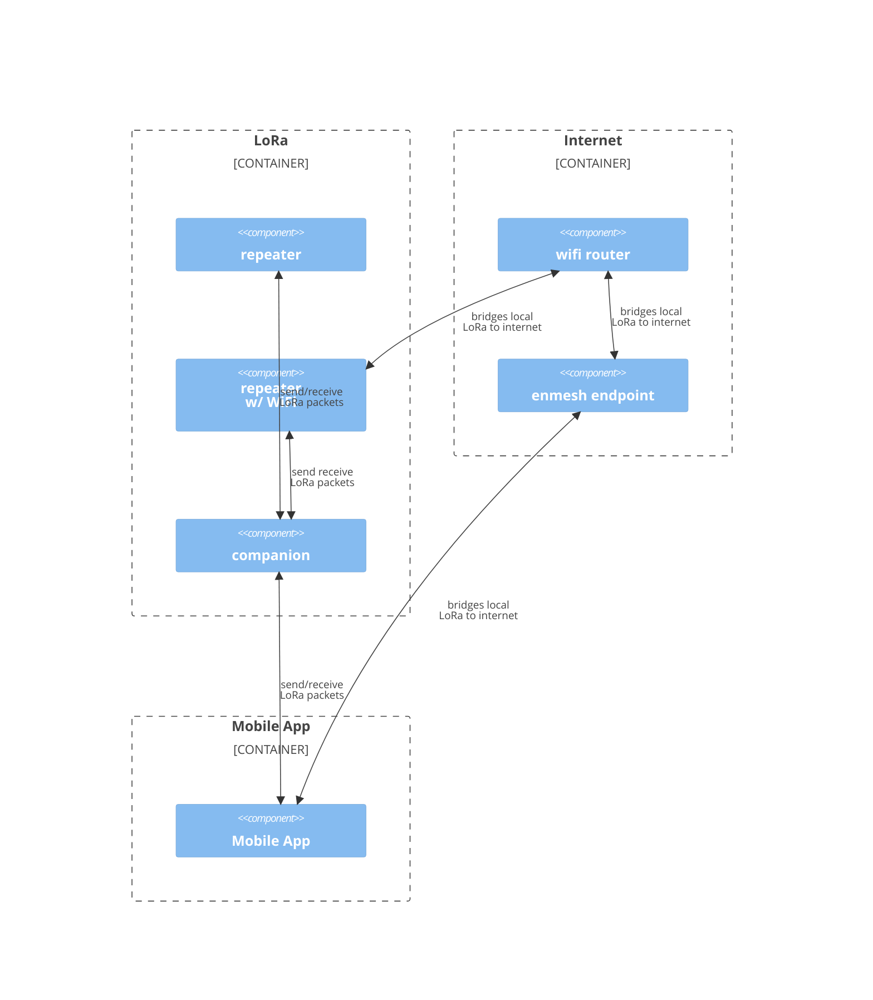

What is Enmesh?
================================================================================
Enmesh is a Rust implementation of LoRa mesh protocols
(supporting Meshtatstic and Meshcore).

### What does Enmesh firmware look like?
You can run a demonstration - [see enmesh demo](./firmware/enmesh/README.md).

### Suported Boards ([see flashing instructions](./firmware/boards/README.md))
<table>
<thead>
<tr> <th>Board</th> <th>LoRa</th> <th>BLE</th> <th>WiFi</th> <th>GPS</th> <th>Sensors</th> </tr>
</thead>
<tbody>
<tr>
  <td><a href="https://heltec.org/project/wifi-lora-32-v3/">Heltec WiFi LoRa 32 v3</a> </td>
  <td> In-Work </td>
  <td> Tested </td>
  <td> In-Work </td>
  <td> TODO </td>
  <td> TODO </td>
</tr>
<tr>
  <td><a href="https://heltec.org/project/wifi-lora-32-v4/">Heltec WiFi LoRa 32 v4</a> </td>
  <td> In-Work </td>
  <td> Tested </td>
  <td> In-Work </td>
  <td> TODO </td>
  <td> TODO </td>
</tr>
<tr>
  <td><a href="https://heltec.org/project/wireless-stick-lite-v2/">Heltec Wireless Stick v2</a> </td>
  <td> In-Work </td>
  <td> Not Tested </td>
  <td> Not Tested </td>
  <td> TODO </td>
  <td> TODO </td>
</tr>
<tr>
  <td><a href="https://heltec.org/project/wireless-stick-lite-v3/">Heltec Wireless Stick v3</a> </td>
  <td> Incomplete </td>
  <td> Not Tested </td>
  <td> In-Work </td>
  <td> TODO </td>
  <td> TODO </td>
</tr>
<tr>
  <td><a href="https://heltec.org/project/wireless-stick-lite-v3/">Heltec Wireless Stick v3</a> </td>
  <td> In-Work </td>
  <td> Not Tested </td>
  <td> In-Work </td>
  <td> TODO </td>
  <td> TODO </td>
</tr>
<tr>
  <td><a href="https://heltec.org/project/wireless-tracker/">Heltec Wireless Tracker</a> </td>
  <td> In-Work </td>
  <td> Not Tested </td>
  <td> In-Work </td>
  <td> TODO </td>
  <td> TODO </td>
</tr>
<tr>
  <td><a href="https://heltec.org/project/wireless-paper/">Heltec Wireless Paper</a> </td>
  <td> In-Work </td>
  <td> Tested </td>
  <td> In-Work </td>
  <td> TODO </td>
  <td> TODO </td>
</tr>
</tbody>
</table>

The architecture requires a minimal BSP layer to be implemeneted to support
other platforms (nrf52 and others).

### Alternative LoRa RF management
Current protocols (Meshtastic, MeshCore) are struggling to guarantee transmit
access for mesh participants in dense environments. Enmesh provides an
alternative design for the use of LoRa RF while still supporting both
Meshtastic and MeshCore.
([see RFC status](https://github.com/redengin/enmesh/wiki/RFC-Process))

### Support for WiFi Bridges
EnMesh firmware supports [MQTT](https://en.wikipedia.org/wiki/MQTT) as a bridge
over [WiFi](https://en.wikipedia.org/wiki/Wi-Fi) - supporting services like
[letsmesh.net](LetsMesh.net).

Repository Overview
================================================================================
* firmware - board support for common hardware
  - boards - flashable implementations of Enmesh
  - soc/* - Rust HALs for LoRa platforms
  - common - shared Rust cargo used by Enmesh
  - enmesh - board agnostic implementation of Enmesh
* [MeshTastic Library](MeshCore) - Rust implementation of MeshCore
  * IN-WORK: MeshCore rapidly evolves, this should become a separate repo
* [MeshCore Library](MeshCore) - Rust implementation of MeshCore
  * IN-WORK: Meshtastic rapidly evolves, this should become a separate repo

Enmesh Physical Architecture
--------------------------------------------------------------------------------

```mermaid
C4Component
    Container_Boundary(lora, "LoRa") {
      Component(repeater, "repeater")
      Component(wifi_repeater, "repeater <br> w/ WiFi")
      Component(companion, "companion")
    }
    BiRel(companion, repeater, "send/receive <br> LoRa packets")
    BiRel(companion, wifi_repeater, "send receive <br> LoRa packets")
    BiRel(wifi_repeater, wifi_router, "bridges local <br> LoRa to internet")
    BiRel(wifi_router, enmesh_endpoint, "bridges local <br> LoRa to internet")
    Container_Boundary(internet, "Internet") {
      Component(wifi_router, "wifi router")
      Component(enmesh_endpoint, "enmesh endpoint")
    }
    Container_Boundary(mobile_app, "Mobile App") {
      Component(mobile_app, "Mobile App")
    }
    BiRel(mobile_app, companion, "send/receive <br> LoRa packets")
    BiRel(mobile_app, enmesh_endpoint, "bridges local <br> LoRa to internet")

  UpdateLayoutConfig($c4ShapeInRow="2", $c4BoundaryInRow="2")
```

Enmesh BLE is implemented to support mobile apps that use Meshtastic or
MeshCore defined BLE services. To further the usage of Enmesh, an
Enmesh Mobile App will be created to support further control per the
Enmesh design using an Enmesh BLE service.