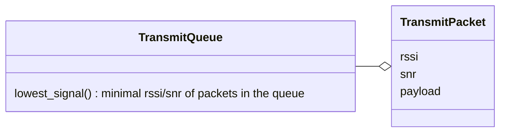
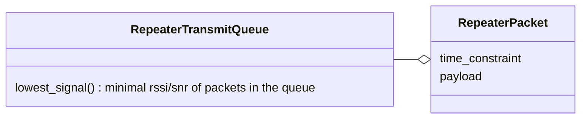
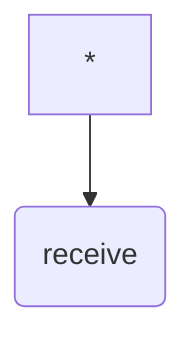

Enmesh Design
================================================================================
Background
--------------------------------------------------------------------------------
Both Meshtastic and MeshCore are evolving to manage `LoRa congestion`.
Enmesh supports both Meshtastic and MeshCore but provides it's own addtional
configuration parameters to mitigate congestion (see [congestion](congestion.md)).

Usage of LoRa is exponentially increasing - expect congestion.

Enmesh LoRa Radio Management
================================================================================
The designs for mesh LoRa protocols (Meshtastic, MeshCore) expect constant
monitoring of the LoRa channel. Where Enmesh can support both protocols
simulaneously via time divisioning (i.e. switch between servicing protocols
for periods of time), in dense environments this would lead to lots of
unreceived packets at the node.

As Enmesh's objective is to maximize LoRa users, the option to support multiple
LoRa protocols via dime division is an `advanced option`. Normal users should
switch their node to use a specific LoRa protocol (e.g. Meshtastic, MeshCore).

The following demonstrates how Enmesh manages LoRa communication for a
specific mesh LoRa protocol - performing a full RX-TX cycle to stay in sync with
the mesh.

The TransmitQueue manages the user's packets that are to be transmitted to
the mesh.

The transmit power is dynamically scaled, increasing transmit power to
to match TransmitQueue::lowest_signal(). The transmit power decays toward
the TransmissionQueue::lowest_signal() over minutes - providing enough
time for an active low signal node to cause an increase in transmit power.

Repeaters use specialized packets that may be time-bound (i.e. response is
required within a certain duration). Enmesh priotizes user traffic to increase
usage. Enmesh prioritizes user traffic - repeater traffic is only handled if
there are no `User` packets in the TransmitQueue.

When the time-bound of a repeater packet expires, it is dropped from the
RepeaterTransmitQueue.

Bridging LoRa traffic - Universal LoRa Communication
================================================================================
The enmesh bridge connects LoRa traffic via the internet.

Enmesh provides universal LoRa communication (both Meshtastic and MeshCore).

### LoRa Congestion
Universal LoRa communications increases the likelihood of `LoRa congestion`.

To mitigate `LoRa congestion` enmesh bridge nodes:
* filter by sender's location (at city level granularity)
    * configurable set of supported locations
        * only white-listed locations will be forwarded locally
* filter by channel type
    * MeshCore local channesl (Public, ....)
        * never forward, as local channels are designed to be used only
            by locals

